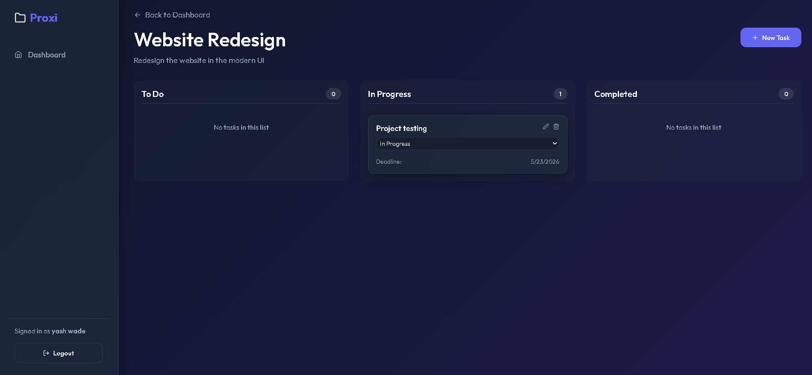
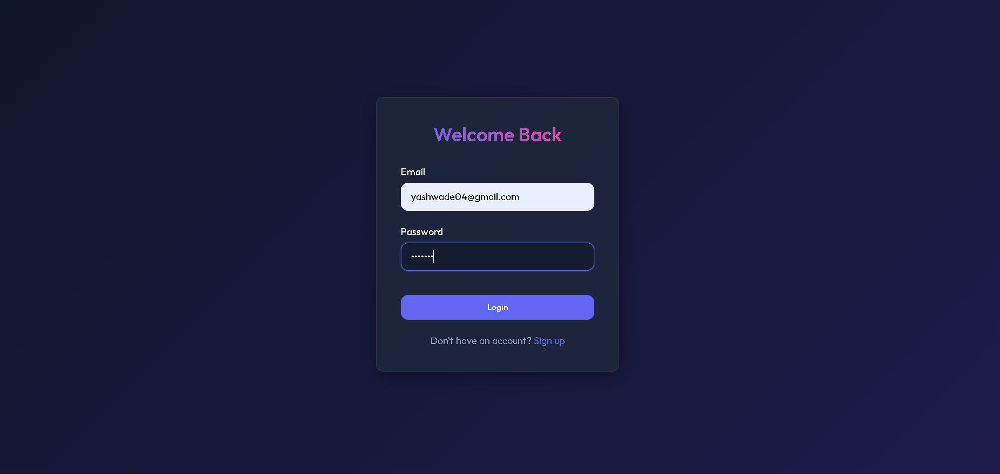
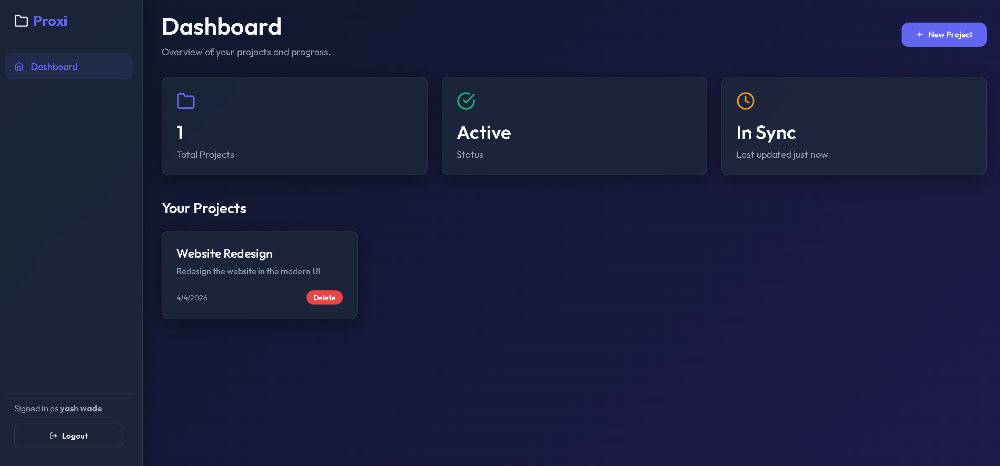
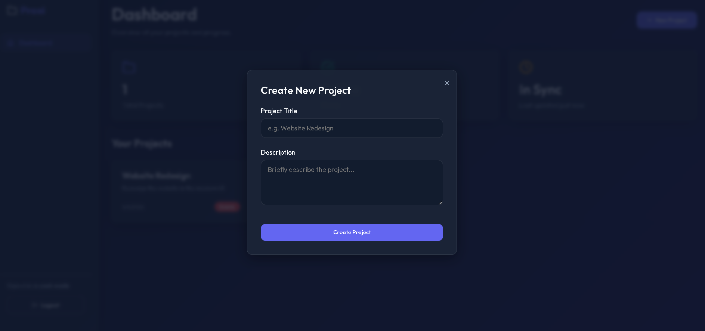

# 📊 Project Management Tool

A full-stack web application that helps users manage projects, assign tasks, set deadlines, and track progress efficiently.

---

## 🚀 Features

- 📁 Create and manage projects  
- ✅ Add, update, and delete tasks  
- 👥 Assign tasks to team members  
- ⏰ Set deadlines and track progress  
- 📊 Status tracking (Pending / In Progress / Completed)  
- 🔐 User authentication (Login/Register)  
- 📱 Fully responsive design  

---

## 🛠️ Tech Stack

### Frontend:
- HTML
- CSS
- JavaScript / React

### Backend:
- Node.js
- Express.js

### Database:
- MongoDB / PostgreSQL

---

## 📂 Project Structure

project-management-tool/
│── client/ # Frontend
│── server/ # Backend
│── .gitignore
│── README.md

---

## ▶️ How to Run

### 1️⃣ Install dependencies

For server:

cd server
npm install
npm start

For client:

cd client
npm install
npm run dev

---

## 📸 Screenshots

---

## 🔐 Authentication

- Secure login and registration system  
- User-specific project access  

---

## 📊 Functional Modules

- Project Creation  
- Task Assignment  
- Progress Tracking  
- Deadline Management  
- User Dashboard  

---

## 📌 Future Improvements

- Notifications 🔔  
- Team collaboration chat 💬  
- File attachments 📎  
- Analytics dashboard 📈  

---

## 👨‍💻 Author

Yash Wade