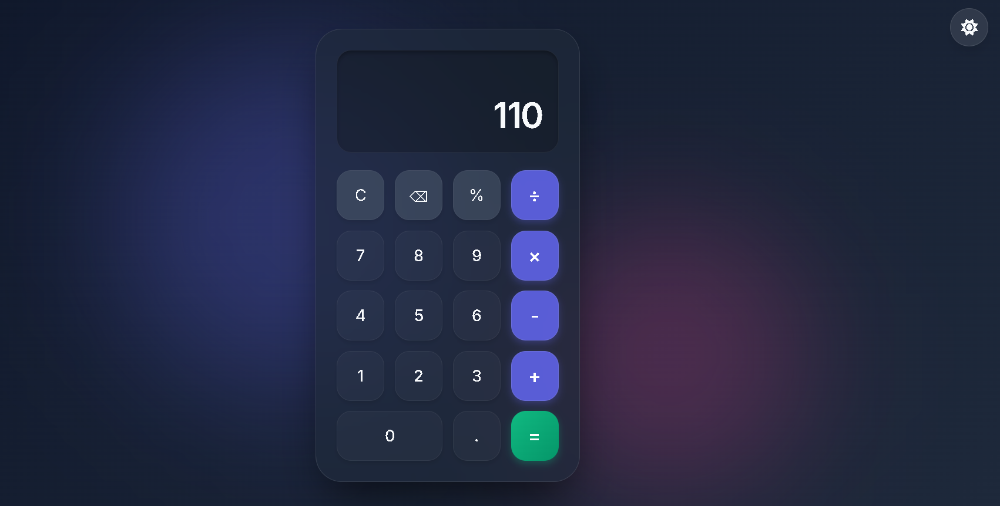

# 🧮 Calculator Project

A simple and responsive calculator built using HTML, CSS, and JavaScript.

---

## 🚀 Features
- Basic operations: +, -, ×, ÷
- Clear (C) and Delete (⌫) functionality
- Responsive design
- User-friendly interface

---

## 🛠️ Technologies Used
- HTML
- CSS
- JavaScript

---

## 📂 Project Structure
```
calculator/
├── index.html
├── style.css
└── script.js
```

---

## 💻 How to Run
1. Save the files as `index.html`, `style.css`, and `script.js`
2. Open `index.html` in your web browser


OR

Use Live Server in VS Code

---

## 📸 Output
Calculator performs basic arithmetic operations with real-time display.

---

## 👨‍💻 Author
Yash Wade