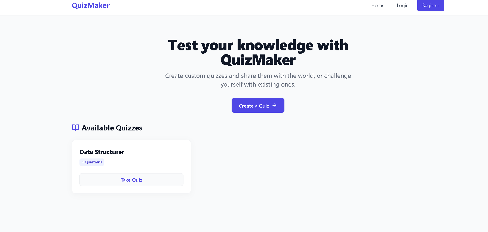
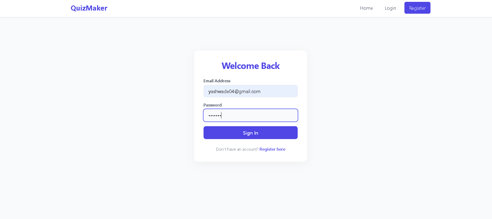
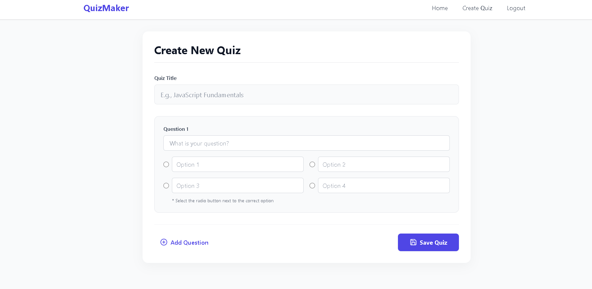
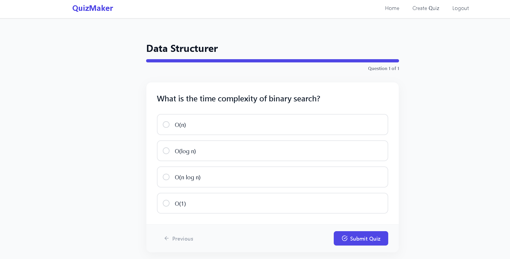

# 🧠 Online Quiz Maker

A full-stack web application that allows users to create, take, and manage quizzes with real-time results and feedback.

---

## 🚀 Features

- 🏠 Home page with options to create or take quizzes  
- ✍️ Create quizzes with multiple-choice questions  
- 📋 View list of available quizzes  
- ▶️ Take quizzes with interactive UI  
- 📊 Instant results with correct answers  
- 🔐 User authentication (Login/Register)  
- 📱 Responsive design for mobile & desktop  

---

## 🛠️ Tech Stack

### Frontend:
- HTML
- CSS
- JavaScript / React (if used)

### Backend:
- Node.js
- Express.js

### Database:
- MongoDB / PostgreSQL

---

## 📂 Project Structure
task2/
│── client/ # Frontend
│── server/ # Backend
│── package.json
│── README.md

---

## ▶️ How to Run

Install Dependencies

For server:

cd server
npm install
npm start

For client:

cd client
npm install
npm run dev

---

## 📸 Screenshot

---

## 🔐 Authentication

- User registration & login system  
- Secure access to quiz creation and results  

---

## 📊 Functional Modules

- Quiz Creation  
- Quiz Taking  
- Quiz Listing  
- Result Evaluation  
- User Dashboard  

---

## 📌 Future Improvements

- Timer for quizzes ⏱️  
- Leaderboard 🏆  
- Admin panel  
- Category-based quizzes  

---

## 👨‍💻 Author

Yash Wade